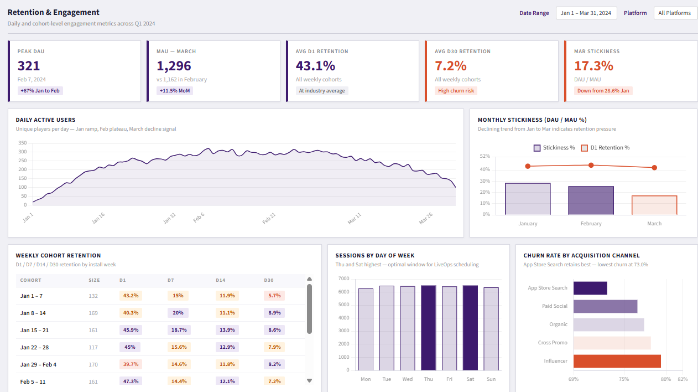
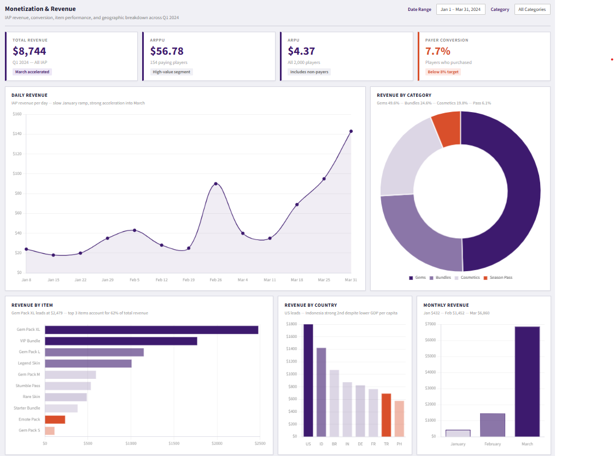

# Stumble Guys — Player Analytics Dashboard


> **Portfolio project using fictional simulated data. No real player data or proprietary Scopely information is used.**
> Dataset covers Q1 2024 and will be expanded for further analysis.

---

## Dashboard Preview

| Retention & Engagement | Monetization & Revenue |
|:----------------------:|:----------------------:|
|  |  |

---

## Overview

This project simulates an **end-to-end analytics workflow** for Stumble Guys (Scopely). The objective is to transform raw gameplay and transaction data into actionable insights that support decision-making across:

- Player retention and cohort analysis
- Engagement depth and session behaviour
- Monetization performance and revenue composition
- Acquisition channel quality and churn drivers

---

## Stakeholder Questions

| # | Business Question |
|---|-------------------|
| 1 | Are DAU and MAU growing, and is stickiness healthy over time? |
| 2 | Which weekly cohorts retain best at D1, D7, D14, and D30? |
| 3 | Which acquisition channels produce the lowest churn? |
| 4 | What is our ARPU, ARPPU, and payer conversion rate? |
| 5 | Which items, categories, and regions drive the most revenue? |

---

## Dataset

6 simulated CSV files covering January 1 – March 31, 2024:

| File | Rows | Description |
|------|------|-------------|
| `players.csv` | 2,000 | Player profiles — country, platform, age group, acquisition source, pass status |
| `sessions.csv` | ~45,000 | Play sessions — date, platform, duration |
| `matches.csv` | ~202,000 | Match records — map, placement, coins earned, completion flag |
| `purchases.csv` | 1,189 | IAP transactions — item, category, price, platform, country |
| `battle_pass.csv` | 238 | Stumble Pass holders — season, tier reached, missions completed |
| `retention.csv` | 12 | Pre-computed weekly cohort retention — D1 / D7 / D14 / D30 |

---

## Dashboards & Insights

### 1. Retention & Engagement

**Business Questions:** Are players returning? Which cohorts and channels retain best?

| KPI | Value | Status |
|-----|-------|--------|
| Peak DAU | 321 | ✅ |
| MAU — March | 1,296 | ✅ |
| Avg D1 Retention | 43.1% | ✅ |
| Avg D30 Retention | **7.2%** | 🔴 High churn |
| Mar Stickiness | **17.3%** | 🔴 Declining |

> **Key Insight:** DAU grew strongly through February but stickiness declined from 28.6% in January to 17.3% in March. D30 retention averages 7.2% — 93 in every 100 players churn within a month. App Store Search produces the lowest churn rate at 73.0%, making it the highest-quality acquisition channel.

---

### 2. Monetization & Revenue

**Business Questions:** Who is paying, what are they buying, and where is revenue coming from?

| KPI | Value | Status |
|-----|-------|--------|
| Total Revenue | $8,744 | ✅ |
| ARPPU | $56.78 | ✅ |
| ARPU | $4.37 | ✅ |
| Payer Conversion | **7.7%** | 🔴 Below 8% target |

> **Key Insight:** Revenue is driven by a small high-value segment — 154 payers at $56.78 ARPPU. Gem Pack XL alone accounts for 28% of total revenue. Android generates 73.9% of revenue despite nearly identical session durations to iOS. Revenue accelerated sharply in March ($6,860 vs $1,452 in February) — warrants investigation into whether a LiveOps event or offer change drove this.

---

## Key Findings
```
CRITICAL  — D30 retention at 7.2% — 93% of players churn within 30 days
CRITICAL  — Stickiness dropped from 28.6% to 17.3% across Q1
WATCH     — Payer conversion at 7.7%, just below the 8% target
POSITIVE  — App Store Search lowest churn channel at 73.0%
POSITIVE  — ARPPU of $56.78 indicates strong high-value payer segment
POSITIVE  — Revenue growing month over month — Jan $432 to Mar $6,860
```

---

## Tools & Technologies

| Tool | Usage |
|------|-------|
| **Python** | Data generation, cleaning, validation, quality checks |
| **SQL** | Cohort retention, DAU/MAU, revenue metrics, platform comparison |
| **HTML / Chart.js** | Interactive self-contained dashboard |
| **GitHub** | Version control and portfolio hosting |

---

## Repository Structure
```
stumble-guys-analytics/
│
├── data/
│   ├── players.csv
│   ├── sessions.csv
│   ├── matches.csv
│   ├── purchases.csv
│   ├── battle_pass.csv
│   └── retention.csv
│
├── dashboard/
│   └── stumbleguys_dashboard.html
│
├── assets/
│   ├── retention_dashboard.png
│   └── monetization_dashboard.png
│
├── generate_data.py
├── 01_cleaning.py
├── 02_analysis.sql
├── .gitattributes
└── README.md
```

---

## Suggested Next Steps

- [ ] Investigate the March revenue spike — correlate with LiveOps event schedule or offer changes
- [ ] Segment D30 retention by acquisition channel to identify which channels produce long-term players
- [ ] Model LTV by payer tier to prioritise retention spend on high-value segments
- [ ] Analyse Stumble Pass tier completion drop-off to identify where engagement weakens mid-season
- [ ] Expand dataset to Q2 and Q3 to identify seasonality and event-driven patterns

---

## Disclaimer

This is a portfolio project. All data is **fictional and simulated** for educational purposes only. No real player data, proprietary business information, or confidential Scopely / Stumble Guys data is used.

---
